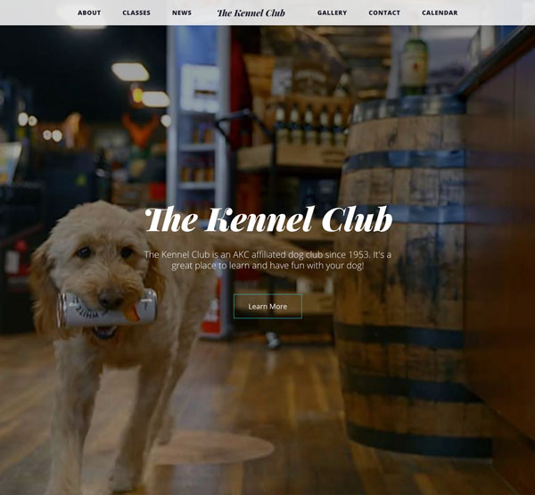
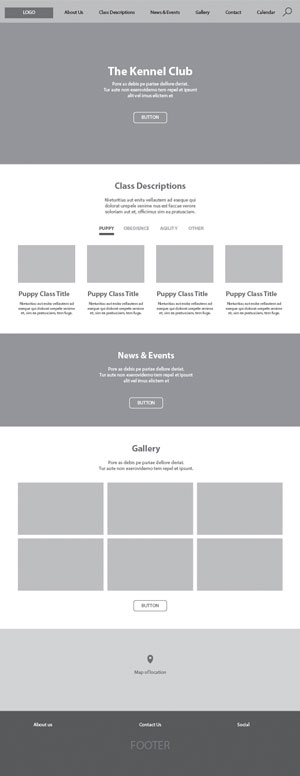
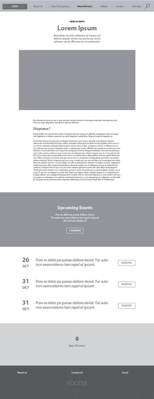
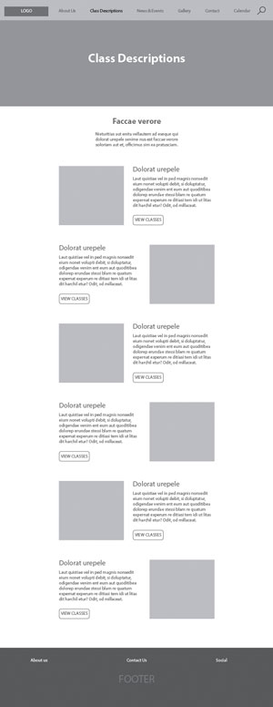
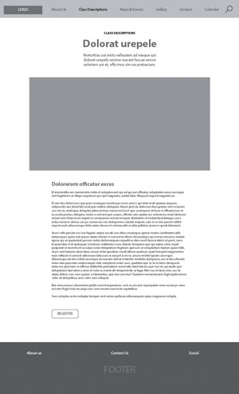

# The Kennel Club

This project was developed to practice applying the concepts I learned while taking classes on React and Redux.\
\

## Introduction

The idea for this project was to find an exisiting website and redesign it to be fully responsive and offer a better user experience. The site I chose to redesign is the FM Kennel Club's website. A link to their site is located in the reference's at the bottom of this page. Key features of the site in the redesign are a functional class reservation form, functional contact form, functional map, class pages, a gallery and a calendar page. If I had more time I would have liked to add a member portal. The member portal would allow members to login and reserve ring time by adding times and dates to the calendar.

## User Interface Design and Prototype:

The site was designed with React utilizing React Router to navigate between pages and Redux for state management. Below are the initial rough wireframes for the homepage, news & events, class descriptions and class registration page.

## Navigation Structure:

The navigation is intented to be easy to navigate and for the user to find what they're looking for with minimal clicks. It should be easy to find classes and register for them. The typical user flow is going from the homepage, to class descriptions and then registering for a class. For users looking for events, the flow goes from the homepage, to news and events and then either registering for the event or viewing the calendar.

## References:

The original website is located at:\
[https://www.fmkennelclub.com](https://www.fmkennelclub.com/)
