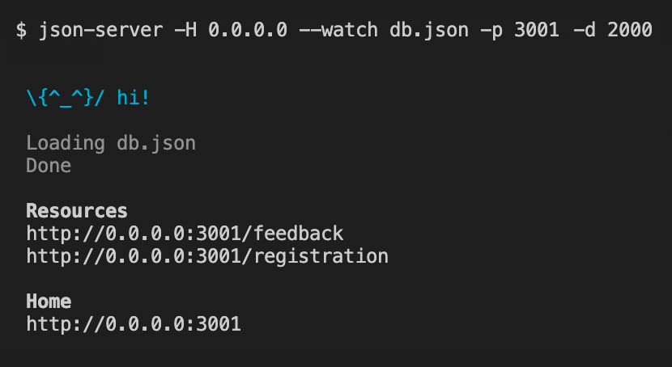

# Json-Server

This project uses a RESTful development server called json-server that serves JSON data for the registration and contact pages.

## Install json-server

The NPM package json-server provides a simple way to set up a RESTful development server for testing. It can also serve up static content from its public folder.\
\
Install json-server globally by typing the following from your bash terminal, in any folder:

### `yarn global add json-server`

This will install json-server so that it can be started from the command line from any folder on your computer.\
\
Enter the following to verify that your json-server installation was successful:

### `json-server -v`

**If you see an error message when you enter the above command -- macOS only:**

For macOS only, if you see an error message, this indicates that your yarn global binaries path is not set up in your bash configuration file.\
\
Copy and paste in the following commands, one at a time. Note: You will not see a confirmation message when you enter these commands. If you don't see an error message, that means the command was successful.

### `cp ~/.bash_profile ~/.bash_profile_backup`

### `echo 'export PATH="$PATH:$(yarn global bin)"' >> ~/.bash_profile`

### `source ~/.bash_profile`

The first command above copies (cp) your existing bash configuration file to a backup, just to be on the safe side. The second command (echo) adds a line to the end of the bash configuration file that tells bash where to find global binaries installed with Yarn. The third command (source) applies the changes to your current bash session.\
\
Once again, try:

### `json-server -v`

## Start and test the server

Move to the **json-server** folder in your bash terminal and type the following at the command prompt to start the server:

### `json-server -H 0.0.0.0 --watch db.json -p 3001 -d 2000`

This should start up a server at **port** number **3001** on your machine, and it will respond to server requests with a simulated **delay** of **2000** milliseconds.\
\
Make sure that your terminal looks like this, with the registration and feedback resources showing:

\
\
If json-server starts but does not show these same resources, that means you either do not have db.json in the json-server folder, or you did not start json-server from inside the json-server folder.\
\
The data from this server can be accessed by typing the following addresses into your **browser address bar:**

### `http://localhost:3001/registration`

### `http://localhost:3001/feedback`
